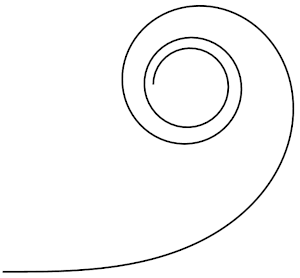

Fresnel Integrals Solution by Van Snyder (NETLIB TOMS 723) Ported to Javascript
===============================================================================

Fresnel integrals are two functions C(t) and S(t) that evaluate to the x and y
coordinates of the Eurler spiral a.k.a. a clothoid (see https://en.wikipedia.org/wiki/Fresnel_integral), which has some interesting properties:

* The length of the spiral from 0 to t is... t.
* The tangent to the spiral at position t is at the angle... t<sup>2</sup> (in radians).
* The curvature κ at t is... 2t.

The spiral starts at (0, 0) and converges around and onto x = y = (1/2)\*sqrt(pi/2).



About the Original Code
-----------------------

This package contains a Javascript port of an algorithm implemented
by W. V. Snyder of the Jet Propulsion Laboratory in January 1992.
The original code is in Fortran and was downloaded from http://www.netlib.org/toms/
in July 2020.

The original code was marked as follows:

    ALGORITHM 723, COLLECTED ALGORITHMS FROM ACM.
    THIS WORK PUBLISHED IN TRANSACTIONS ON MATHEMATICAL SOFTWARE,
    VOL. 22, NO. 4, December, 1996, P.  498--500.
    Originally appeared in
    VOL. 19, NO. 4, December, 1993, P.  452--456

    Copyright (C) 1992, California Institute of Technology.
    U. S. Government sponsorship under NASA contract NAS7-918 is acknowledged.

Some parts were additionally marked as originally from the Naval Surface Warfare
Center, a U.S. government agency. And the source code was published by the
ACM, which may also claim copyright.

Although the original code indicates it is copyrighted, I have posted
this port without any particular license to do so. Evaluate your own risk when
using this package. To the extent that I have any copyright claims to this port,
I waive them.

Another solution of the Fresnel integrals can be found at http://www.netlib.org/cephes/qlibdoc.html#qfresnl.

Using This Library
------------------

To evaluate the Fresnel integrals at t, call:

```js
const Fresnel = require("./index.js");
var point = Fresnel(t);
console.log(point.x, point.y);
```

The `Fresnel` function returns an object with properties `x` and `y`, which correspond to the Fresnel functions `C(t)` and `S(t)`, respectively. The object additionally as properties `f` and `g` which are related functions also solved by the original library.

For example:

```js
const Fresnel = require("./index.js");

const L = 200;

console.log('<svg viewBox="0 0 200 200" xmlns="http://www.w3.org/2000/svg">');
console.log('<polyline fill="none" stroke="black" points="');
for (let i = 0; i < 200; i++) {
  var pt = Fresnel(i / 60);
  console.log(pt.x*L + "," + pt.y*L)
}
console.log('"/>');
console.log('</svg>')
```
